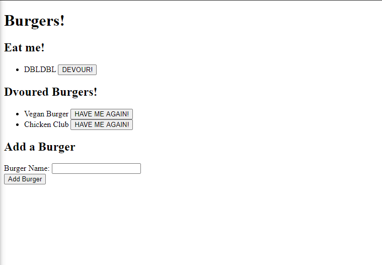

# Employee Tracker
In this project i created a handlebars app along with a mysql database which allows the user to add and remove burgers that they ahve eaten.

## Image of the APP

## Built With

* [Javascript](https://www.javascript.com/)
* [Node.js](https://nodejs.org/en/)
* [NPM](https://www.npmjs.com/)
* [MySQL](https://www.mysql.com/)
## Code Snippet
    The code below is how datbases are created i nmysql along with the table used in this app in order to manage the burger data

    CREATE DATABASE burgers_db;
USE burgers_db;
CREATE TABLE burgers(
	id INT NOT NULL AUTO_INCREMENT,
	burger_name VARCHAR(255) NOT NULL,
	devoured BOOLEAN DEFAULT false,
	PRIMARY KEY (id)
);

## Github Repository
- [Burger Repo](https://github.com/GabrielPineda808/burger)
## Authors

* **Gabriel Pineda** 

- [Link to Github](https://github.com/GabrielPineda808)
- [Link to LinkedIn](https://www.linkedin.com/in/gabriel-pineda-a94535195/)